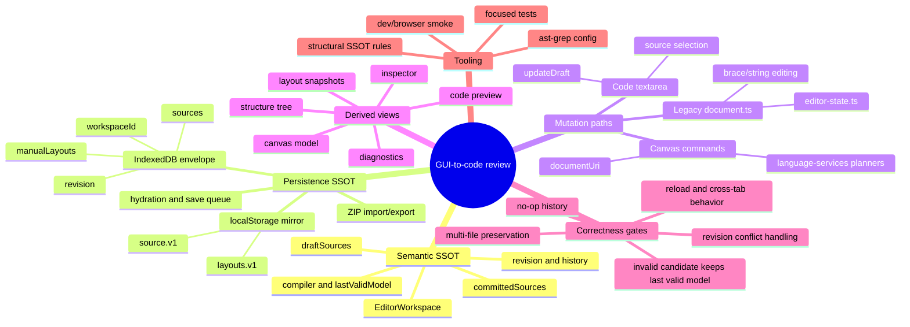

# GUI-to-code SSOT research map

This is the initial map for the deep review. It is evidence-oriented: every
branch should end in one owner, one mutation path, and one verification.

## Mind map



## Decision tree

```text
Start: inspect a GUI-to-code state or mutation
|
|-- Is it semantic LikeC4 data?
|     |-- Yes -> Is EditorWorkspace the only mutable owner?
|     |            |-- No -> SSOT violation: identify the competing owner.
|     |            `-- Yes -> Does every mutation pass through one typed command/document layer?
|     |                         |-- No -> duplicate/ad-hoc mutation path.
|     |                         `-- Yes -> compile candidate and verify revision/history.
|     `-- No -> Is it geometry/layout?
|                  |-- Yes -> Is it stored only as the documented layout snapshot?
|                  |            |-- No -> geometry/semantic ownership leak.
|                  |            `-- Yes -> verify snapshot identity and drift behavior.
|                  `-- No -> Is it durable workspace state?
|                               |-- Yes -> Is IndexedDB the authoritative owner?
|                               |            |-- No -> persistence SSOT violation.
|                               |            `-- Yes -> verify atomic save, hydration, conflict, reload.
|                               `-- No -> classify as derived UI state and keep it non-authoritative.
|
`-- For every accepted change:
      preserve all source files -> preserve last valid model on failure
      -> increment revision only on a real change -> test browser-visible behavior.
```

## Initial hypotheses to verify

1. `localStorage` is still a competing source/layout owner.
2. The code editor and several canvas flows assume `model.c4`, which may break
   multi-file workspaces and entry-document identity.
3. The legacy brace-based command path remains wired despite the source-owner
   decision gate.
4. `updateDraft` may create revisions for byte-identical content.

## Confirmed additional branches

5. Reload hydration calls `EditorWorkspace.create` with a hard-coded revision
   of `0`, then writes that state back through `replace`. A persisted workspace
   with revision `N > 0` is therefore re-persisted as revision `0`, weakening
   optimistic concurrency and invalidating the durable revision contract.
6. A save conflict is converted into an error, but the runtime does not load a
   fresh envelope, block further edits, or expose a reload/reconcile action.
   Subsequent saves continue with the old `durableRevision` and fail again.
7. `EditorWorkspaceState` does not retain `entryDocumentUri`. Persistence
   reconstructs it from the lexicographically first source, so ZIP metadata can
   silently change after reload/export.
8. `SPEC.md` promises ZIP support for config and `likec4lib`, while the current
   envelope/manifest model represents only generic source files and manual
   layouts. This needs either an explicit supported-file contract or an
   implementation/schema extension.
9. `SPEC.md` promises a backup of the last valid revision, but IndexedDB has
   only one `active` record and no backup/journal key. Corruption recovery can
   therefore overwrite the only durable copy with the fallback state.
10. `ROADMAP.STATUS.md` claims a feature branch and completed contract state,
    while the checked-out repository is `main` at the merge commit. The managed
    status is stale as an execution artifact and must not be treated as current
    branch/release evidence.

## Evidence table

| Branch               | Primary evidence                                                                         | Expected invariant                                                               |
| -------------------- | ---------------------------------------------------------------------------------------- | -------------------------------------------------------------------------------- |
| Persistence revision | `src/editor/workspace.ts:364-389`, `src/editor/use-durable-workspace.ts:71-89`           | Hydration preserves the durable revision or performs a guarded migration.        |
| Conflict recovery    | `src/editor/use-durable-workspace.ts:104-127`, `App.tsx:258-264`                         | A conflict leads to a fresh snapshot/reconcile state, not a permanent save loop. |
| Entry document       | `src/editor/persisted-workspace.ts:59-76`, `src/editor/use-workspace-runtime.ts:324-328` | The selected entry URI is explicit and is the code-editor mutation target.       |
| ZIP scope            | `SPEC.md:217-222`, `src/editor/workspace-bundle.ts:26-49`                                | Declared import/export file classes match the serialized schema and codec.       |
| Backup promise       | `SPEC.md:217-220`, `src/editor/indexeddb-workspace.ts:4-7`, `:90-98`                     | Recovery retains a previous valid envelope before replacement.                   |
| Managed status       | `ROADMAP.STATUS.md:3-16`, repository `main` / `7cedbbe18`                                | Branch and completion state are generated/read back from current VCS state.      |

## AST-grep research result

The project scan is configured with four narrow warning rules. With the
official project configuration, 48 TypeScript files are scanned and all four
rules load successfully:

- `gui-to-code-direct-localstorage-read`
- `gui-to-code-direct-localstorage-write`
- `gui-to-code-single-source-draft-update`
- `gui-to-code-legacy-document-command-owner`

The official CLI also supports `ast-grep test`; the next tooling improvement
should add positive/negative rule fixtures so these warnings are protected
against both rule drift and accidental broadening. The current `npx`-based
script is convenient but network/cache dependent; a locked devDependency is a
better CI boundary.
