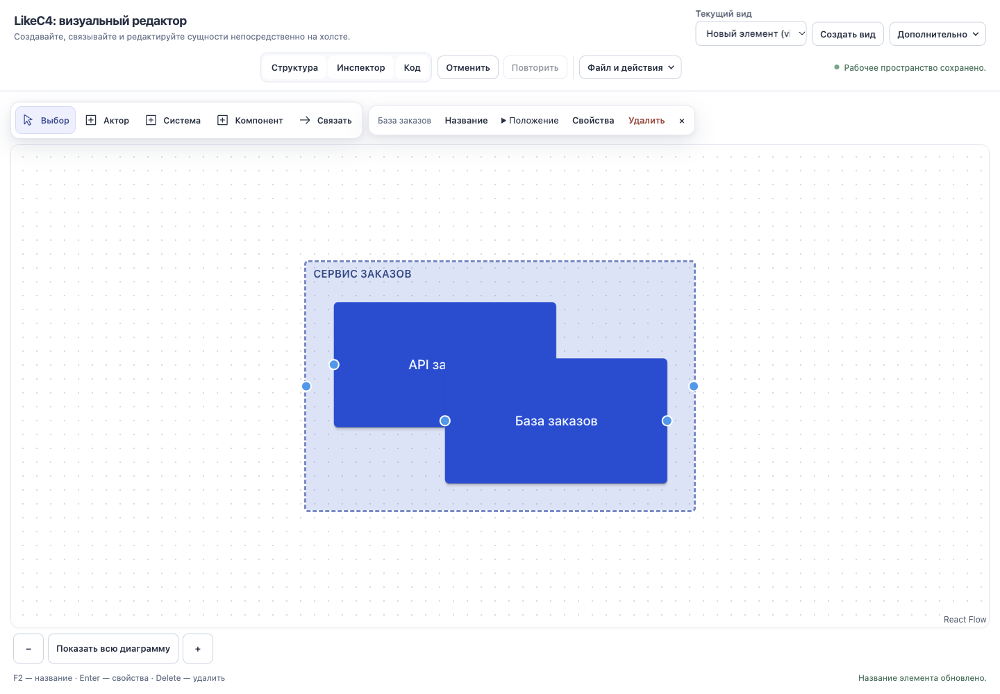

# Проверка создания многоуровневой C4 диаграммы сервиса

5 октября 2026. Desktop Chrome 1440×1000. Результат: **changes_requested**.
Предыдущие 54 browser scenarios проверяли отдельные поддержанные операции и не подтверждают качество полного
C4 authoring. Реальный путь обнаружил ошибки размещения и восстановления режима, а также недостающие функции.

## Что я пытался собрать

«Покупатель → Сервис заказов», внутри сервиса API и PostgreSQL, внутри API контроллер заказов.
Планировались C1 контекст, C2 контейнеры и C3 компоненты. Работал через кнопки, формы, дерево и выбор вида.
DSL не вводил и не импортировал; скрытый source только читал для проверки и сохранения evidence.

В модели получились 5 элементов, 2 связи и 2 scoped views. C1 не собран: actor → system присутствует в source,
но на холсте видна только связь API → база. C2/C3 удалось собрать частично, используя «Компонент» вместо
отдельного C4-контейнера. [Полученный source](service-built-through-ui.c4),
[состояния, размеры и SHA-256](journey-evidence.json).

## Что произошло в интерфейсе

1. «Новый пустой проект» → «Система» → название «Сервис заказов».
   Первый вид остался «Новый элемент (view1)» после изменения названия системы.
2. «Актор» → Enter → «Покупатель». Он создался как `system.actor`, то есть внутри сервиса.
   Намерение создать внешнего участника интерфейс не спросил и не объяснил.
3. Inspector → Подробности → Родитель → Без родителя → Переместить.
   Actor стал root, но исчез с текущего scoped view. Быстро создать глобальный контекст через текущую форму
   «Создать вид» нельзя: она требует selected element и всегда создаёт `view ... of ...`.
4. Дважды «Компонент» → Enter; названия «API заказов» и «База заказов».
   Два sibling элемента пересеклись на **160×99 px** при размере каждого 320×180. Название API частично закрыто.
   Parent containment не считается ошибкой; измерено именно пересечение siblings.
5. Дополнительно → Режим раскладки → Автоматическая.
   API и база разошлись по вертикали. Reload без промежуточных правок вернул manual и старое перекрытие.
6. В базе выбрал Подробности → Технология и ввёл PostgreSQL → Сохранить свойства.
   Source и подпись обновились; карточка осталась обычным синим прямоугольником, без логотипа/картинки.
7. «Сбросить раскладку» действительно показал неперекрывающуюся компоновку. Это отдельный обход проблемы:
   переключатель режима не равен этому действию. После последующих правок/reload координаты остались разнесены,
   но selector снова показывал manual; неизменность auto mode после отдельного reset-only reload не проверялась.
8. Выбрал API → Создать вид → «C3 — Компоненты API» → добавил «Контроллер заказов».
   Вложенная модель и отдельный child view работают; dropdown переключает виды. C2 показывает API/базу,
   C3 показывает API/контроллер. Ошибочное смешение уровней в этом примере не обнаружено.
9. Вернулся в view1. API сообщает «Открывает вид view2», но double-click открыл inline rename и оставил view1.
   В видимых app actions нет команды «Углубиться» или breadcrumb «Назад к сервису».
10. Через форму связи создал API → база, затем Покупатель → сервис. Обе операции сохранены.
    Вторая дала сообщение «Связь создана в модели, но текущий вид её не отображает». C1 остался недоступен
    в проверенном canvas пути. Форма умеет обращаться к скрытым элементам; утверждать, что relation вообще
    невозможно создать, было бы неверно.

## Подтверждённые проблемы и недостающие функции

| ID    | Приоритет и тип          | Наблюдение                                                                                                                          | Требуемый результат                                                                                                                        |
| ----- | ------------------------ | ----------------------------------------------------------------------------------------------------------------------------------- | ------------------------------------------------------------------------------------------------------------------------------------------ |
| C4-01 | P1 capability gap        | Нет понятного C1 bootstrap/root-view; внешний actor сначала вложен, после переноса скрыт; связь root actor → system не отображается | Шаблон C4, внешние участники на уровне контекста, явный scope создания и C1 вид без DSL                                                    |
| C4-02 | P2 defect                | Два обычных create-at в центре создали перекрытие 160×99 px                                                                         | Новые siblings получают ближайшее свободное место; parent-child containment разрешён                                                       |
| C4-03 | P2 defect UX persistence | Выбор auto исправил картинку, reload вернул прежний manual snapshot                                                                 | Явная сохраняемая авторасстановка с Undo/Redo, reload и ZIP; preview должен отличаться от commit                                           |
| C4-04 | P2 capability gap        | Технология — строка; PostgreSQL не добавляет изображение                                                                            | Каталог с поиском/превью, technology + icon одной операцией, возможность своего текста и сброса значка                                     |
| C4-05 | P2 capability gap        | Нет типа Container и понятных C4 presets; API/база созданы обычными components                                                      | Система/приложение/база/очередь/компонент с согласованным C4 смыслом и оформлением                                                         |
| C4-06 | P2 capability gap        | Tree всегда раскрыт, нет hide/lock/order/group actions                                                                              | Рабочая панель структуры и слоёв с выбором, сворачиванием, видимостью и блокировкой; порядок регулируется в допустимых renderer boundaries |
| C4-07 | P2 UX gap                | Child view создаётся вручную; double-click не углубляет; нет явного перехода/возврата                                               | «Добавить уровень», «Углубиться», breadcrumbs; C1/C2/C3 связаны с одной моделью                                                            |
| C4-08 | P3 UX gap                | View title остался placeholder, IDs/FQN занимают основные экраны                                                                    | Понятные названия уровней, редактирование title, технические детали по запросу                                                             |
| C4-09 | P3 runtime polish        | favicon.ico 404; startup warning повторился 50 раз                                                                                  | Корректный favicon и понятные диагностические logs; не подавлять настоящие compiler errors                                                 |

Под «слоями» здесь проверены и semantic hierarchy, и visual visibility/locking/order. В текущем коде
StructureTree — recursive selection list с `aria-expanded=true`, без collapse/visibility/lock state.
Фиксированные z-index parent/child у renderer существуют; пользовательского управления слоями нет.
Это не означает, что нужно вводить второй mutable graph или хранить XYFlow nodes в приложении.

## Что работает и где граница доказательства

Создание/названия, перенос к root, технология как текст, scoped view creation, child creation, переключение видов,
создание двух семантических связей и точные source bytes после reload сработали. Ошибок потери source в этом проходе
не обнаружено. Автораскладчик умеет развести узлы; проблема в начальном размещении и пользовательском contract режима.

Console error — запрос favicon.ico 404, не compiler crash. Повторяющийся «No likec4 documents found» — warning.
Не выдаём эти наблюдения за доказательство «без ошибок». ZIP/Undo нового C4 пути, большие модели, остальные браузеры
и человеческая приёмка в этом проходе NOT_RUN. Один истёкший UID Chrome MCP исправлен новым snapshot и не считается
ошибкой продукта.

JS/CSS SHA-256 совпали с предыдущим frozen candidate index-CSKAq45U.js; все source hashes из прежнего manifest
совпали. Product code не менялся в этом аудите. Предыдущие tests сохраняют свою узкую доказательную силу;
новые gaps они не покрывают. [Итоговый частичный canvas](partial-service.png).

Дальнейший порядок и критерии: [план исправления](PLAN.md). Общий desktop checklist дополнен новыми C4 criteria;
WP-16 возвращён в active. Подтверждать полную работоспособность сейчас нельзя.
